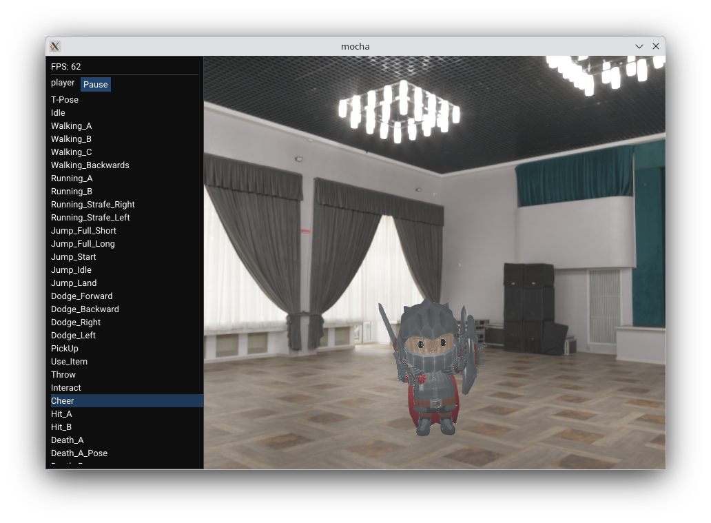

# Mocha

## THIS PROJECT WAS PUT ON HOLD!
So a working pose estimation demo lives in the pose-estimation branch.
Just have to then map that to the 3d model.
However, I'm taking a break from this project to work on something else,
since I've been working on this for 2+ months at this point.

---



Motion capture app. You record a video of someone moving
and that motion is mapped to a 3d animation of a human model
that can be replayed. For example, you could map the choreography
of a [dancer](https://www.youtube.com/watch?v=QJMKRkUPELk) and
use that to animate a 3d model.
This concept could extend into a fully fledged game where
you are rewarded for exercising.

To build the project, using arch linux as an example:
```bash
# Clone the source code
git clone https://github.com/aabiji/mocha
cd mocha && mkdir assets

# Install the dependencies
yay -S opencv hdf5 vtk

# Download the MoveNet SinglePose Lighting model from here:
# https://www.kaggle.com/models/google/movenet/tfLite/singlepose-lightning-tflite-float16
# And place it into the assets folder

# You should download an HDRI and place it into the assets folder,
# like this one for example: https://polyhaven.com/a/dancing_hall

# You should also download some 3d models and
# place them into the assets folder, take these
# https://kaylousberg.itch.io/kaykit-adventurers for example

# You should also download the Roboto Regular font and
# place it into the assets folder: https://fonts.google.com/specimen/Roboto

# Build and run
cmake -S . -G Ninja -B build -DCMAKE_POLICY_VERSION_MINIMUM=3.5
cd build
ninja && ./app
```

Project outline:
- [x] **Engine**: responsible for rendering and animating the 3d models
- [ ] **Human pose tracker**: responsible for obtaining information about the subject's skeleton in real time
- [ ] **Bridge library**: responsible for connecting the engine and the human pose tracker
